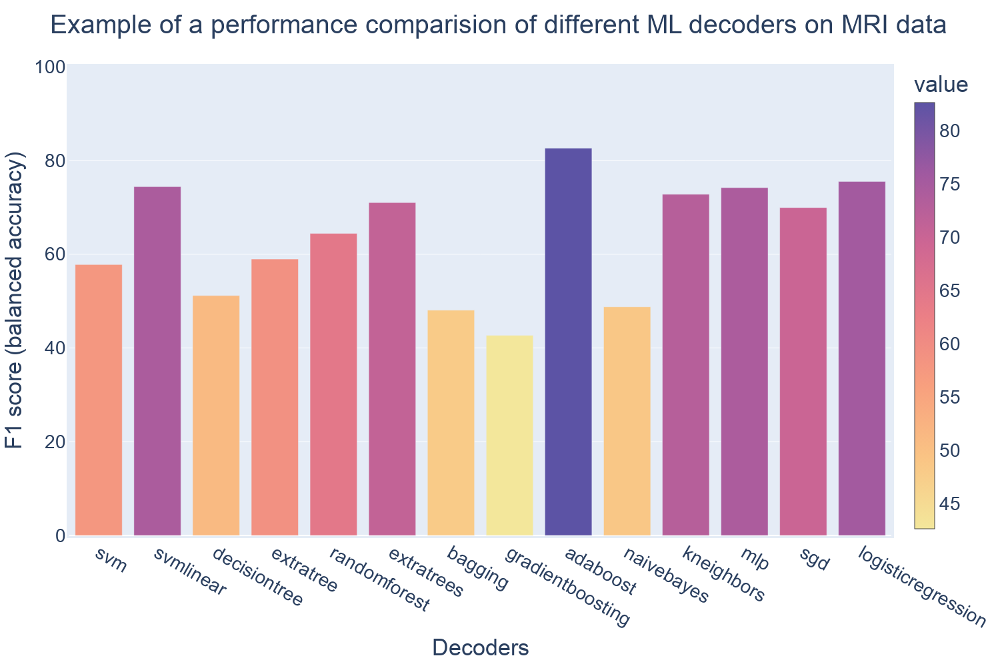
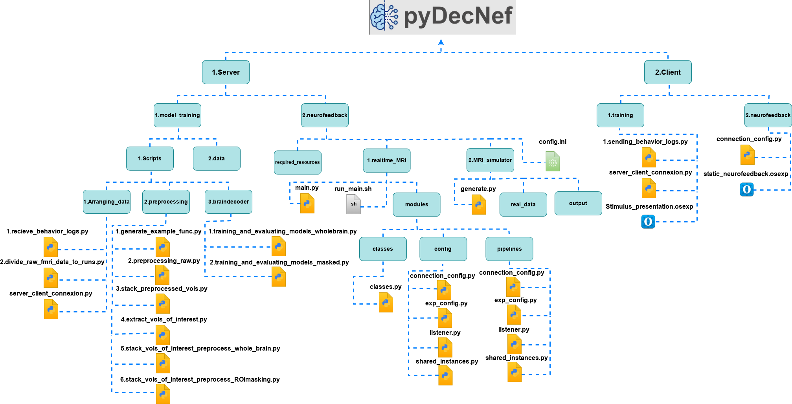

  

  

## About:

PyDecNef2.0 includes an intuitive and efficient Python framework for real-time fMRI decoded neurofeedback, integrating various machine learning techniques for decoder construction (see [Figure 1](ML)), and also including a co-adaptation algorithm for decoded neurofeedback training to improve the the learning curves during  training and Bayesian optimization algorithms for closed-loop applications. This library is a continuation of the PyDecNef project [link](https://github.com/pedromargolles/pyDecNef), that incorporated scripts for fMRI pre-processing, decoder construction, data post-processing and a full pipeline for neurofeedback training.

PyDecNef2.0: is an open-source, Python-based real-time fMRI decoded neurofeedback framework, that supports extensive customization and personalization for various experimental setups.

**For more information and tutorials visit [pyDecNef project webpage](https://pedromargolles.github.io/pyDecNef/).**

## License:

pyDecNef2.0 is © 2024-2025 by Najemeddine Abdennour & Pedro Margolles & David Soto.

This program is free software: you can redistribute it and/or modify it under the terms of the [GNU General Public License version 3](https://github.com/pedromargolles/pyDecNef/blob/main/LICENSE) as published by the Free Software Foundation.

This program is distributed in the hope that it will be useful, but without any warranty; without even the implied warranty of merchantability or fitness for a particular purpose. See the GNU General Public License for more details.

Permissions of this strong copyleft license are conditioned on making available complete source code of licensed works and modifications, which include larger works using a licensed work, under the same license. Copyright and license notices must be preserved. Contributors provide an express grant of patent rights.

## Introduction:
PyDecNef follows the structure depicted in [Figure 2](structure), where we have two main computers. The first is the server and the second is the client. 
- The server side is the main component and performs all the pre-processing and decoding operations. 
- The client side is mostly used for providing stimulus and visual feedback to the participants in the MRI scanner, as well as for receiving the participants responses that are eventually communicated to the server side.

## Usage and description:

This package relies on the classic DecNef setup and procedure of starting with training a decoder which eventually will be used in the real-time neurofeedback training phase.

#### I. Data collection for for training:
1. The initial step of recording the fMRI data only uses the Opensesame script "stimulus_presentation.osexp" on the client side. This is used to display the stimulus to the participant. The script is under the path '2.Client/1.training', and all details and information on the Opensesame framework and its installation can be found [here](https://osdoc.cogsci.nl/). The log files in CSV format generated by the Opensesame script are needed for the training process since they include the relevant classes and participant's responses. These files can be moved to the server side through running the "1.sending_behavior_logs.py" script at the same path. On the server side the "1.receive_behavior_logs.py" script under the path '1.Server/1.model_training/1.Scripts/1.Arranging_data' needs to be run simultaneously as well. (Note: The process of moving the log files in this package is still in the experimental phase and can encounter some issues, alternatively these files can be moved manually by the user.)
2. Before we start the training procedure, we need to pre-process the data. We start with dividing the raw fMRI data according to the runs by running the script "2.divide_raw_fmri_data_to_runs.py" under the path '1.Server/1.model_training/1.Scripts/1.Arranging_data'. The data preprocessing phase is then as simple as running every script under the path '1.Server/1.model_training/1.Scripts/2.preprocessing' in a numerical order. All the generated pre-processed files will be under the path: '1.Server/1.model_training/2.data/preprocessed'. We note that Region of Interest (ROIs) masks are used in the experiment, the relevant files must be placed under the path: '1.Server/1.model_training/2.data/rois_masks'.
3. Training the decoder requires the use of the scripts under the path: '1.server/1.model_training/1.scripts/3.braindecoder/'. The "1.training_and_evaluating_models_wholebrain.py" is used to train the decoder with the whole brain data and the "2.training_and_evaluating_models_masked.py" is used for the ROI-based masks applied to the whole-brain data. These scripts offer an optional arguments to choose the type of decoder. The default decoder is the `extratrees` classifier from the scikit learn python library. The list of classifiers is: ["svm", "svmlinear", "decisiontree", "extratree","randomforest", "extratrees", "bagging", "gradientboosting","adaboost", "naivebayes", "kneighbors", "mlp", "sgd","logisticregression" ], which can be accessed by adding a numerical argument to the script from `0` to `13` following the sequential order of appearance in the list. The argument `14` can be used to evaluate existing models; here the script will execute a leave one run out cross validation test. In order to do this the decoder’s file has to be named "evaluated_model" and placed under the path '1.Server/1.model_training/3.models/wholebrain' for the whole brain decoder or placed under '1.Server/1.model_training/3.models/masked/{mask_name}' with {mask_name} being the name of the mask used during the training of the decoder. Both scripts also incorporate some preprocessing steps that can be removed by changing the variable `preprocessing` to `False` inside the script. The script outputs a CSV file  (`info.csv`) that includes the information about the  model and the preprocessing pipeline.

#### II. DecNef real-time training:
1. The neurofeedback phase is handled by the "2.neurofeedback" folders both in the server and the client side.
2. On the server side, we only need to provide the required resources at the "required_resources" folder, including:
- The ROI mask used for decoder training inside the path "1.server/2.neurofeedback/required_resources/{subject_tag}/masks" where {subject_tag} corresponds to the tag used for the participants, namely, in the form  "sub-1". If no mask was used in the decoder training phase, the mask is supposed to be `example_func_deoblique_brainmask.nii` that was generated inside the path: "1.server/1.model_training/2.data/preprocessed/example_func/" during the preprocessing phase.
- The decoder inside "models"
- The reference scan used for the volume realignment during the preprocessing needs to be placed inside the "training_session_ref_image" folder. This is  the `example_func_deoblique_brain.nii` file generated during the preprocessing phase "1.model_training/1.scripts/2.preprocessing/1.generate_example_func.py" script.
- The training zscore data inside "training_zscoring_data" folder which include the two files, namely, `zscoring_mean_array.npy` and `zscoring_std_array.npy` generated in the training phase inside the "1.model_training/2.data/preprocessed/stacked_vols_of_interest/" folder. In the case that a mask is used this files are named `zscoring_mean_array_{mask_name}.npy` and `zscoring_std_array_{mask_name}.npy` in the "masked_stacked_vols_of_interest_{mask_name}" folder with {mask_name} is the name of the mask used in training.  
- In the case of using co-adaptation, the training data and labels of the decoder need to be placed inside the "co_adaptation_base_training_stacked_vols_of_interest" folder. These files are `detrended_zscored_stacked_vols_of_interest.nii.gz` and `detrended_zscored_stacked_vols_of_interest_labels.csv` generated in the training phase inside the "1.model_training/2.data/preprocessed/stacked_vols_of_interest/" folder. Even in the case of using masks during the training process, these files are the same.
3. Additionally the `config.ini` file is the main tool to tweak the parameters and change the settings of the neurofeedback pipeline if needed before starting DecNef.
4. After providing the required resources and checking the configuration, we can start the DecNef real-time training by running the `1.realtime_fMRI/run_main.sh` script through the following command `sh run_main.sh`. The script will prompt you for the participant number, session number and run number. Naturally, the script will break or stop functioning if there is something wrong with the parameters or data, For example if you point to the wrong folder path regarding the incoming fMRI scans (i.e. this was left as `/firmm/20240903.test` in the `config.ini` file). 
5. On the client side, we need to run the Opensesame script that corresponds with our desired experimental task and stimuli. This script is responsible for presenting the stimulus and generating the feedback for the participant during DecNef. The Opensesame script that we provided generates the feedback in the form of a disk, you can read more about it in our [paper](https://doi.org/10.1101/2025.02.21.639408). This script  will also generate log files for the different runs with details about the decoding accuracy and other important information about the real-time DecNef operation.
6. We also provide a simulation procedure to make sure everything is ready for the real experiment. The simulation could be activated by changing the `simulated_experiment` variable to `True` in the `config.ini` file and including pre-recorded fMRI DICOM files in the path "1.server/2.neurofeedback/2.MRI_simulator/real_data". Then, we need to run the `1.server/2.neurofeedback/2.MRI_simulator/generate.py` script to simulate generating new DICOM files similar to the way we do with the MRI scanner, but before that we need to start by running the `1.realtime_fMRI/run_main.sh` script and the Opensesame script in the same the way as the real-time DecNef procedure.
  
  

### Installation and requirements:
PyDecNef scripts are intended to be run in Python 3.6 or above using as minimum external libraries as possible and relying on Python standard library to maximize compatibility across Python versions.
We also recommend setting up a new conda environment for the package, to have a clean installation of the required packages. The required packages are:
- Pandas
- Nipype
- Nilearn
- scikit-learn
- Colorama

Additionally we used Opensesame 4.0 and Opensesame 4 scripts at the client side for stimuli presentation to the participants. We recommend using python version 3.11.7 since it provides the best compatibility with the scripts and Opensesame 4.0 tool (check out the Opensesame [documentations](https://osdoc.cogsci.nl/4.0/download/) for more details).